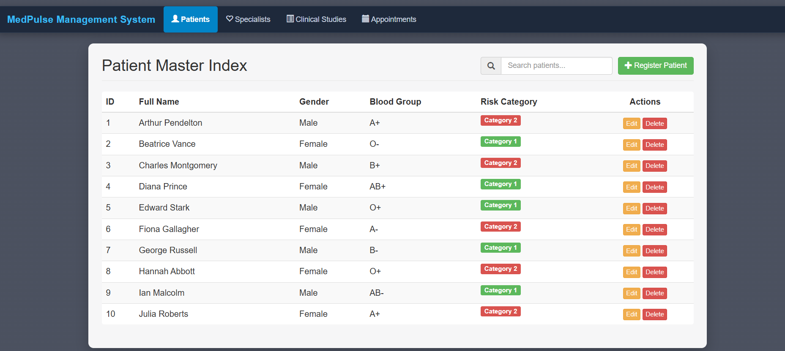

# MedPulseDB Web Application

## 1. Project Overview

MedPulseDB is a clinical treatment and diagnostic management system that combines a Flask web application with a MySQL relational database. The system manages patient profiles, clinical studies, medical specialists, study–specialist assignments, treatment sessions, diagnostic tests, drug formulations, diagnostic clinics, and pharmacy stock.

The database contains nine related tables and demonstrates primary keys, foreign keys, a composite key for the many-to-many relationship between clinical studies and medical specialists, views, a stored procedure, a trigger, sample data, and SQL operations for retrieving, joining, aggregating, inserting, updating, and deleting data.

The web application provides a browser-based interface for interacting with the MedPulseDB database. All sample data is fictional and is used for educational demonstration and testing.

## 2. Technical Stack

**Backend environment:** Python  with the Flask framework  
**Database management system:** MySQL  


## 3. Project Structure

```text
/sql/create_tables.sql
/sql/load_data.sql
/sql/views.sql
/sql/triggers_procedures.sql
/sql/queries.sql
/diagrams/ERD.png
/src/Project.py
/src/templates/             
/src/static/                 
/report.docx
/presentation.pptx
/README.md
```


## 4. How to Load the Database and Run the Web Application

Follow the steps sequentially to create the database schema, populate the tables, create the views and advanced objects, install the Python dependencies, configure the MySQL connection, and run the Flask application locally.

### Step 1: Start MySQL

Start a local MySQL 8.x server using MySQL Workbench, XAMPP, WampServer, Docker, or a native MySQL installation.

Open MySQL Workbench, phpMyAdmin, or the MySQL command-line client.

### Step 2: Create and Select the Database

Execute:

```sql
CREATE DATABASE IF NOT EXISTS MedPulseDB;
USE MedPulseDB;
```

### Step 3: Create the Tables and Constraints

Execute the script:

```text
/sql/create_tables.sql
```

This creates the nine project tables, primary keys, foreign keys, unique constraints, and referential actions.

### Step 4: Load the Sample Data

Execute:

```text
/sql/load_data.sql
```

This inserts fictional sample records into the database tables.

### Step 5: Create Views and Advanced Database Objects

Execute the following scripts:

```text
/sql/views.sql
/sql/triggers_procedures.sql
```

These create the active-study view, abnormal-test view, `sp_GetStudiesByPatient` stored procedure, and `trg_validate_stock_quantity` trigger.

### Step 6: Install Python Dependencies

Open a terminal in the project root or inside the `/src/` directory and install the required packages:

```bash
pip install flask
pip install flask_mysqldb
```


### Step 7: Configure the MySQL Connection

Open the main Flask server file:

```text
/src/The Project.py
```

Confirm that the connection settings match your local MySQL server:

```python
app.config['MYSQL_HOST'] = 'localhost'
app.config['MYSQL_USER'] = 'root'
app.config['MYSQL_PASSWORD'] = ''
app.config['MYSQL_DB'] = 'MedPulseDB'
```


### Step 8: Run the Flask Web Application

From the project directory, execute:

```bash
python "src/Project.py"
```


```bash
python "Project.py"
```

When the Flask server starts successfully, open a web browser and navigate to:

```text
http://127.0.0.1:5000/
```

### Step 9: Web Application


